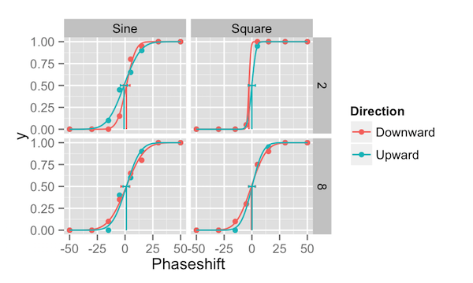
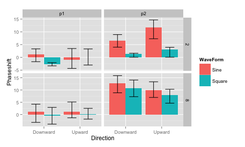
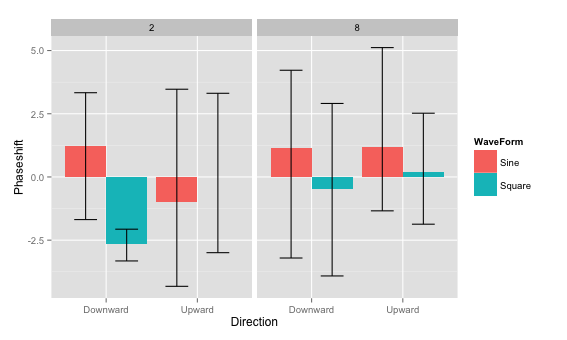

<!-- README.md is generated from README.Rmd. Please edit that file -->
quickpsy is an R package developed by [Daniel Linares](http://www.dlinares.org) and [Joan López-Moliner](http://www.ub.edu/viscagroup/joan/) to quickly fit and plot psychometric functions for multiple conditions. It makes an extensive use of Hadley Wickham's packages [ggplot2](http://ggplot2.org/) and [dplyr](https://CRAN.R-project.org/package=dplyr).

To understand the fundamentals of fitting psychometric functions in R, we recommend the book [Modeling Psychophysical Data in R](http://www.springer.com/gp/book/9781461444749).

Features
--------

-   Fits and plots multiple conditions with minimal coding.

-   The user does not need to introduce initial parameters.

-   Calculates parametric and non-parametric bootstrap confidence intervals.

-   Compares parameters and thresholds for different conditions using bootstrap.

-   Guess and lapses can be fixed or free as parameters.

-   Fits cumulative normal, logistic, weibull functions or any function defined by the user.

-   Facilitates the reading of several data files.

-   Performs goodness-of-fit (deviance).

-   Computes AIC.

Install
-------

Download and install [R](https://www.r-project.org/) (we also recommend [Rstudio](https://www.rstudio.com/)).

Type on the console

``` r
install.packages('quickpsy')
```

Example
-------

``` r
library(quickpsy)
library(MPDiR) # contains the Vernier data; use ?Venier for the reference

fit <- quickpsy(Vernier, Phaseshift, NumUpward, N, 
                grouping = .(Direction, WaveForm, TempFreq))
plotcurves(fit)
```



``` r
plotpar(fit) #plot the parameters
```



``` r
plotthresholds(fit)
```



Help
----

To obtain information and examples for specific functions use *?*

``` r
?plotthresholds
?quickpsy
```

For more examples and information visit [www.dlinares.org/quickpsy.html](http://www.dlinares.org/quickpsy.html)

Other R packages
----------------

-   [psyphy](https://CRAN.R-project.org/package=psyphy): among other things, it provides links functions to [fit psychometric functions using an approach based on generalized linear models](http://www.dlinares.org/psychopract.html#fitting-using-generalized-linear-models).

-   [modelfree](http://personalpages.manchester.ac.uk/staff/d.h.foster/software-modelfree/latest/home): fits psychometric functions using a non-parametric approach.
